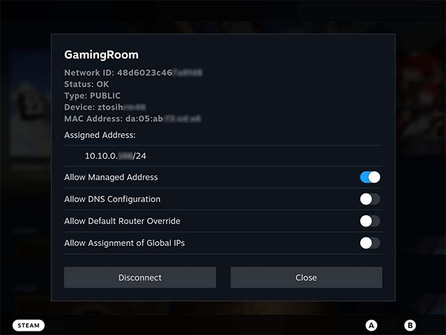

# Decky Zerotier

This project is a [Zerotier](https://www.zerotier.com/) client plugin designed for SteamDeck based on [Decky Loader](https://github.com/SteamDeckHomebrew/decky-loader) to support the LAN connection function of some games.

## 🎨 Features
- View ZeroTier service status and connected networks
- Join a Zerotier network
- Manage Zerotier network settings

## Screenshots

## 💾 Installation
1. First install [Decky Loader](https://github.com/SteamDeckHomebrew/decky-loader), download the installation script in SteamDeck desktop mode and execute it.
1. Then install this plugin
   1. Press the  button to open the quick access menu and select  icon to open the Decky menu.
   1. Select the  icon to open the plug-in market, find this plug-in and choose to install it.
   
## 🤝 Third Party
- This project directly integrates [ZeroTierOne](https://github.com/zerotier/ZeroTierOne)(based on [BSL version 1.1](https://mariadb.com/bsl11/) license) as a Git submodule.
- Other project dependencies are managed by pnpm, see [package.json](https://github.com/hyacz/decky-zerotier/blob/main/package.json) for details

## 📜 Acknowledgements
- This project design refers to [Zerotier DesktopUI](https://github.com/zerotier/DesktopUI)
- Thanks to NGnius, AAGaming, Train and others for their help in the [Discord channel](https://deckbrew.xyz/discord)