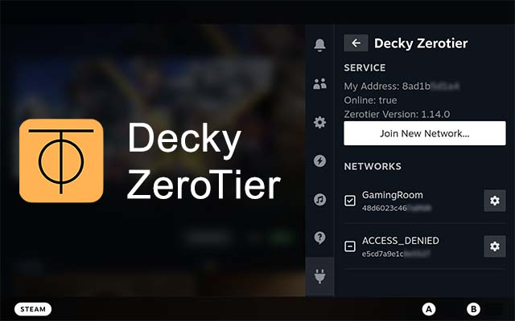
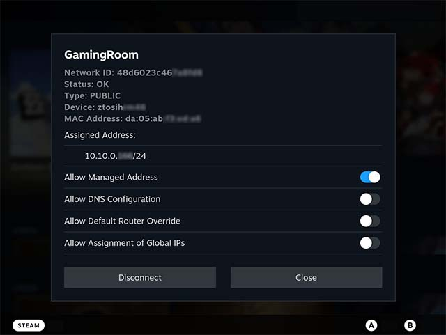

  

# Decky Zerotier

本项目是基于 [Decky Loader](https://github.com/SteamDeckHomebrew/decky-loader) 为 SteamDeck 设计的一个 [Zerotier](https://www.zerotier.com/) 客户端插件，用以支撑一些游戏的局域网联机功能。

## ⚠️ 注意
- 本插件基于 Decky Loader V3 引入的新 API 开发，目前只能在 Decky Loader V3 Prerelease 以及 Steam Beta 版中使用。
- 本插件依赖于 ZeroTierOne，其需要以 root 权限运行，详细请查看 zerotier/ZeroTierOne#996。（不需要用户做任何额外操作，Decky Loader 会处理所有事情，此处只说明需要 root 权限的原因。）

## 🎨 功能
- 查看 ZeroTier 服务状态与已连接的网络
- 加入 Zerotier 网络
- 管理 Zerotier 网络设置

## 🌠 截图

  

## 💾 安装
1. 首先安装 [Decky Loader](https://github.com/SteamDeckHomebrew/decky-loader)，在 SteamDeck 的桌面模式下下载对应安装脚本并执行。
1. 然后安装本插件
   1. 按  实体按键打开快速访问菜单，并选择  图标，打开 Decky 菜单。
   1. 选择  图标打开插件市场，找到本插件并选择安装。
   
## 🤝 第三方
- 本项目以 Git submodule 的形式直接集成了 [ZeroTierOne](https://github.com/zerotier/ZeroTierOne) (基于 [BSL version 1.1](https://mariadb.com/bsl11/) 许可)
- 其余项目依赖由 pnpm 管理，详情参见 [package.json](https://github.com/hyacz/decky-zerotier/blob/main/package.json)

## 📜 致谢
- 本项目设计参考了 [Zerotier DesktopUI](https://github.com/zerotier/DesktopUI)
- 感谢 NGnius, AAGaming, Train 以及其他人在 [Discord 频道](https://deckbrew.xyz/discord) 给予我的帮助